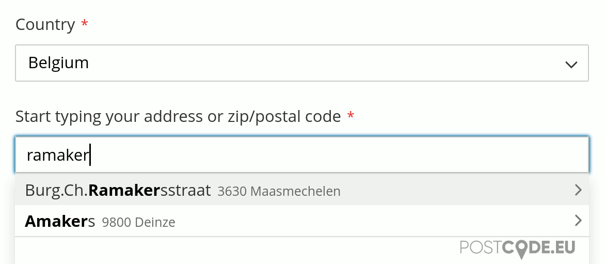
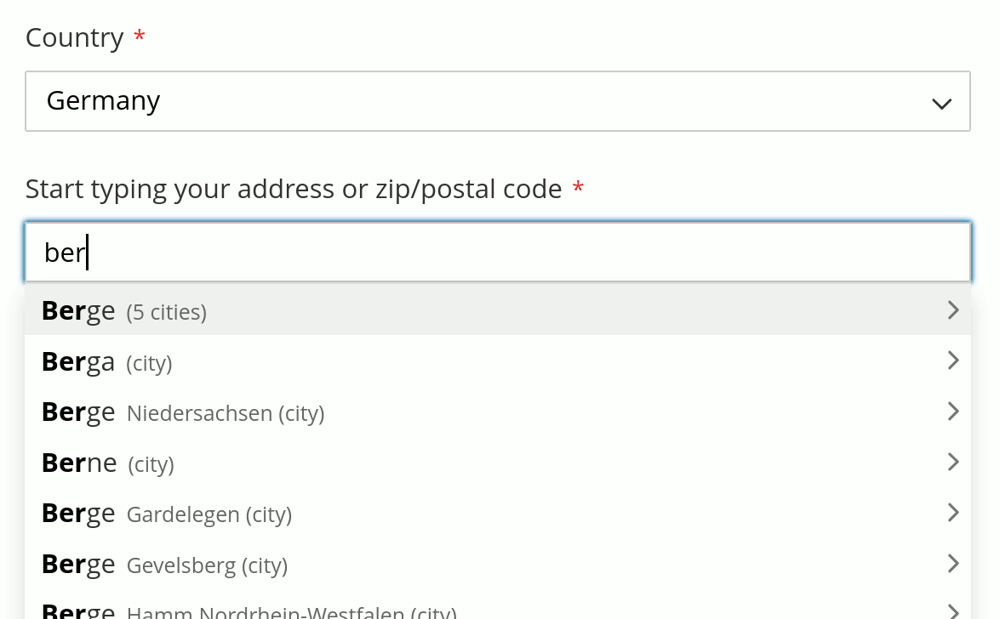
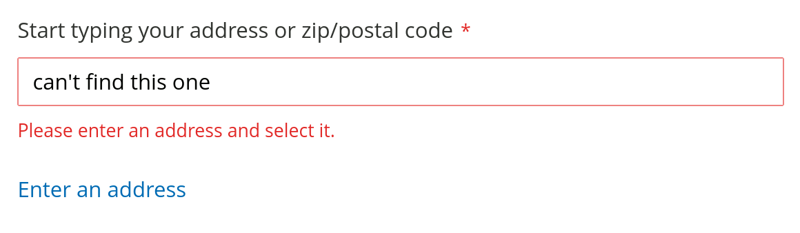
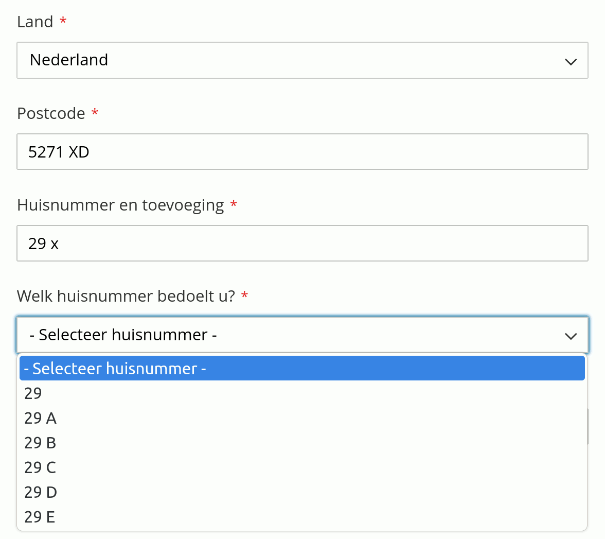
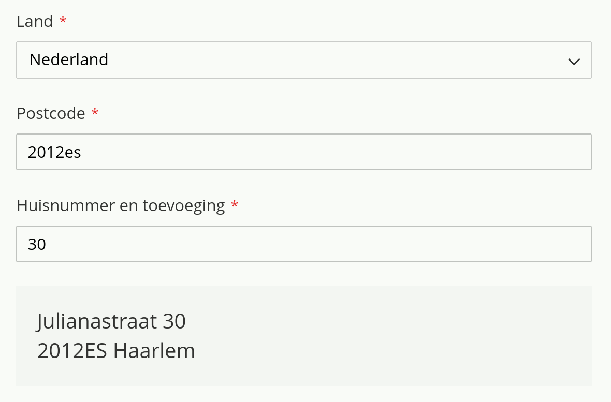

# International Address API module for Magento 2

Adds autocompletion for addresses to the checkout page. [Multiple countries](https://www.postcode.nl/services/adresdata/internationaal) are supported using official postal data via the [Postcode.eu](https://postcode.eu) API.

This module is maintained by [Postcode.nl](https://postcode.nl) since version 3.0.0. Earlier versions were developed by [Flekto](https://www.flekto.nl).

# Postcode.eu account

A [Postcode.eu account](https://www.postcode.nl/en/services/adresdata/producten-overzicht) is required.
Testing is free. After testing you can choose to purchase a subscription.

# Installation instructions

1. Install this component using Composer:

```bash
$ composer require postcode-nl/api-magento2-module
```

2. Upgrade, compile & clear cache:
```bash
$ php bin/magento setup:upgrade
$ php bin/magento setup:di:compile
$ php bin/magento cache:flush
```

# Screenshots

## International Address API

A single field for autocompletion:




To allow users to skip the autocomplete field and manually enter an address, there's an option to add a link to manual address entry:



## Dutch Postcode API

Get a Dutch address by postcode and house number. In this example asking the user to select from valid house number additions:



A formatted address is shown when the postcode and house number combination is valid (this is the default output option):



Other output options are:

* Hide address fields until postcode and house number combination is valid.
* Disable address fields until postcode and house number combination is valid.
* No change; address fields remain visible and editable.

# Compatibility

Although we can't guarantee compatibility with other checkout modules, our module works well with most one-step-checkout modules. If you are having issues and think this may be caused by our module, please [contact Postcode.nl](tech@postcode.nl) and tell us which other module(s) and version(s) are used.

If you found the solution already and have some code to contribute, feel free to open a pull request in this repository.

## OneStepCheckout.com configuration instructions

1. Go to Stores -> Configuration -> Sales -> Postcode.eu Address API
   1. 'Change address fields position' to 'no'
2. Go to Stores -> Configuration -> Sales -> OneStepCheckout
   1. The following fields need to be enabled for the billing **and** shipping fields:
      1. street.0
      2. postcode
      3. city
      4. region
   2. Add the following fields to the billing **and** shipping fields:
      1. address_autofill_nl.postcode
      2. address_autofill_nl.house_number
      3. address_autofill_nl.house_number_select
      4. address_autofill_intl
      5. address_autofill_formatted_output
   3. Optional: you may need to apply some custom CSS to display the fields correctly. You may set the region field to hidden.


# Address API documentation

You can find our API documentation at https://developer.postcode.eu/documentation.

# FAQ and Knowledge Base

* View Frequently Asked Questions at https://www.postcode.eu/#faq.
* For more questions and answers, see https://kb.postcode.nl/help
* If the above didn't answer your question, [contact us](https://www.postcode.eu/contact).

# License

The code is available under the Simplified BSD License, see the included LICENSE file.
