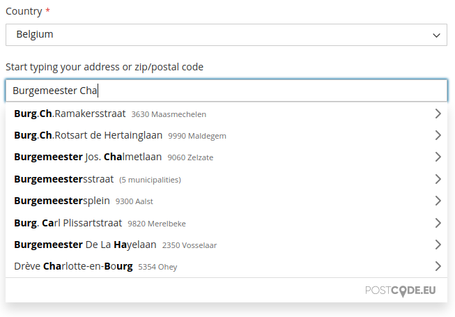
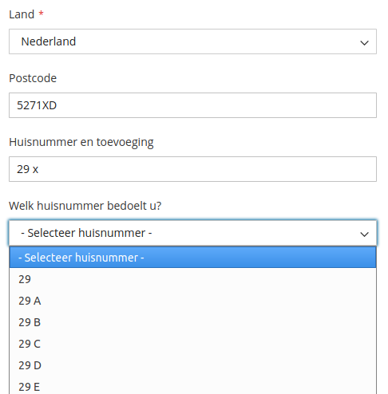
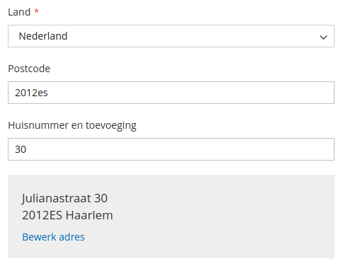

Postcode.eu International Address API module for Magento 2
=============

Adds autocompletion for addresses to the checkout page. Multiple countries are supported using official postal data via the [Postcode.eu](https://postcode.eu) API.

This module has been created by [Postcode.nl](https://postcode.nl) and [Flekto](https://www.flekto.nl).


Postcode.eu Account
=============

A [Postcode.eu account](https://www.postcode.nl/en/services/adresdata/producten-overzicht) is required.
Testing is free. After testing you can choose to purchase a subscription.

Installation instructions
=============

1. Install this component using Composer:

```bash
$ composer require postcode-nl/api-magento2-module
```

2. Upgrade, compile & clear cache:
```bash
$ php bin/magento setup:upgrade
$ php bin/magento setup:di:compile
$ php bin/magento cache:flush
```

License
=============

The code is available under the Simplified BSD License, see the included LICENSE file.

Screenshots
=============

International autocomplete:



Dutch address by postcode and house number:



Option to show formatted output:


